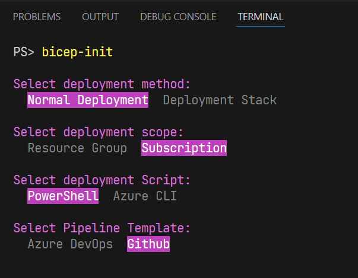

# BICEP Starter Pipelines  

Welcome to my **BICEP Starter Pipelines** repository! 😊  

This is a collection of pipelines for starting a bicep project.


## ⚠️ Attention  

> This repository is currently a **prototype** and is not fully tested, especially the bash scripts.
>
> I may improve on it in the future. Meanwhile I hope you find it helpful in its current state. 😊
>
> I also included [bicep tests](https://github.com/Azure/bicep/issues/11967), which is currently still in development.
>
> Please, don't hate me all again. I just want to share if it helps someone else. 😅🦖


## Usage  

### Method 1: VS Code Launch-Task (F5)

1. Open the repository in Visual Studio Code.
2. Press `F5` to start a Launch Task.
```PowerShell
PS> bicep-init ./destinationFolder
```

---

### Method 2: Directly call from PowerShell Terminal

```PowerShell
PS> ./bicep-init.ps1 ./destinationFolder
```

---

### Method 3: Install from [PowerShell Gallery](https://www.powershellgallery.com/packages/BicepStarterPipelines)

1. Install the module from the PowerShell Gallery:
    ```PowerShell
    Install-Module -Name BicepStarterPipelines -Scope CurrentUser
    ```
2. Use the `bicep-init` in current directory:
    ```PowerShell
    bicep-init .
    ```

---
### Method 4: Directly add to PowerShell Profile

1. Copy the `BicepStarterPipelines` folder to your PowerShell profile location.
2. Edit your PowerShell profile (`Microsoft.PowerShell_profile.ps1`) and add the following line:  
    ```PowerShell
    Import-Module -Name $PSScriptRoot/BicepStarterPipelines/
    ``` 
3. Use the `bicep-init` in current directory:  
    ```PowerShell
    bicep-init .
    ```

