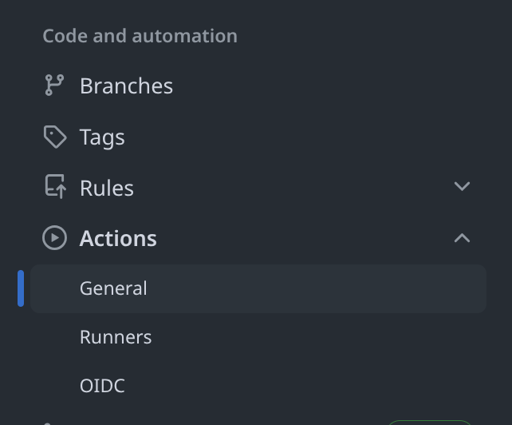
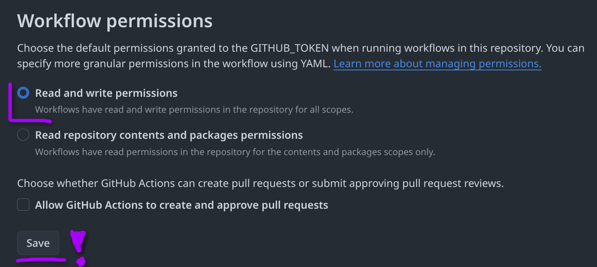

# BICEP Starter Pipelines

<div align="center">

<br><br>


A PowerShell module that scaffolds a complete Bicep project — including pipelines, infrastructure files, and module registries — in seconds.

</div>

## 🙏 Acknowledgments

- ☁️ **Microsoft** for [Azure Bicep](https://github.com/Azure/bicep) and the amazing IaC tooling
- 💙 **PowerShell Gallery** for making module distribution so easy
- 🔧 **GitHub Actions** & **Azure DevOps** teams for their CI/CD platforms
- 💖 **Open Source** contributors worldwide


---

## ⚠️ Prototype Notice

This repository is currently a **prototype** and not fully tested. Improvements will come in future updates. 😅🦖

| Platform | Status |
|----------|--------|
| Windows  | ✅ Tested |
| Linux    | ⚠️ May work |
| macOS    | ⚠️ May work |

---

## 💡 What does this do?

`bicep-init` is an interactive CLI wizard that sets up a ready-to-use Bicep project in your target folder. It asks you a few questions and then generates:

- **Bicep infrastructure files** (main.bicep, parameters)
- **CI/CD pipelines** for GitHub Actions or Azure DevOps
- **Optional: a private Bicep module registry** with versioning and automated publishing


---

## 📁 Project Structure

```
📦 BICEP Starter Pipelines
├── 📁 BicepStarterPipelines/               # PowerShell module
│   ├── 📋 BicepStarterPipelines.psd1       # Module manifest
│   ├── 📋 BicepStarterPipelines.psm1       # Module entrypoint
│   └── 📁 functions/
│       ├── ⚡ Initialize-BicepStarterPipeline.ps1  # Main wizard logic
│       ├── ⚡ Initialize-BicepTemplate.ps1          # Template scaffolding
│       └── 📁 library/
│           ├── 📁 common/                   # Shared modules & pipeline steps
│           ├── 📁 deployment/               # Deployment pipeline templates
│           └── 📁 registry/                 # Bicep registry pipeline templates
├── 📁 BicepStarterPipelines.Tests/         # Pester tests
├── 📋 bicep-init.ps1                        # Standalone script (no install needed)
└── 📖 README.md
```

---

## 🚀 Usage

### Option 1 — Install from PowerShell Gallery

```powershell
Install-Module -Name BicepStarterPipelines -Scope CurrentUser
bicep-init
```

### Option 2 — Run without installing

```powershell
./bicep-init ./destinationFolder
```

> The destination folder is optional — by default it initializes in the current directory.

---

## 🔧 Prerequisites

### Azure Authentication

The pipeline needs permission to deploy resources in Azure.

<details>
<summary><b>Azure DevOps</b></summary>

Create a **Service Connection** in Azure DevOps and reference it in the generated `Deploy Bicep` pipeline.

</details>

<details>
<summary><b>GitHub</b></summary>

Create a repository- or environment-scoped secret called `AZURE_AUTH` with one of the following formats:

#### OIDC (Workload Identity Federation) — recommended

```json
{
  "auth_type": "OIDC",
  "tenantId": "00000000-0000-0000-0000-000000000000",
  "subscriptionId": "00000000-0000-0000-0000-000000000000",
  "clientId": "00000000-0000-0000-0000-000000000000"
}
```

Set up a Federated Credential on either a:
- [User Managed Identity](https://learn.microsoft.com/en-us/entra/workload-id/workload-identity-federation-create-trust-user-assigned-managed-identity?pivots=identity-wif-mi-methods-azp#configure-a-federated-identity-credential-on-a-user-assigned-managed-identity)
- [App Registration](https://learn.microsoft.com/en-us/entra/workload-id/workload-identity-federation-create-trust?pivots=identity-wif-apps-methods-azp#github-actions)

#### Client Secret

```json
{
  "auth_type": "ClientSecret",
  "tenantId": "00000000-0000-0000-0000-000000000000",
  "subscriptionId": "00000000-0000-0000-0000-000000000000",
  "clientId": "00000000-0000-0000-0000-000000000000",
  "objectId": "00000000-0000-0000-0000-000000000000",
  "clientSecret": "00000000-0000-0000-0000-000000000000"
}
```

</details>

---

### Bicep Registry *(only required for registry pipelines)*

The pipeline needs permission to create and push **Git tags** for versioning.

<details>
<summary><b>Azure DevOps</b></summary>

Grant the build service **Contribute** permission on the repository:

1. Go to **Project Settings → Repos → Repositories → [Your Repo] → Security**
2. Allow **Contribute** for one of:
   - `<Repository Name> Build Service`
   - `Project Collection Build Service <project>`
   - `Project Collection Build Services Account`

More info: [Azure DevOps repo permissions](https://learn.microsoft.com/en-us/azure/devops/repos/git/set-git-repository-permissions?view=azure-devops#open-security-for-a-repository)

</details>

<details>
<summary><b>GitHub</b></summary>

Allow the workflow to push tags in your repository settings:





</details>

---

## 📦 How the Bicep Registry works

Each module lives in its own folder and contains a `version.json` file with:

```json
{
  "version": "1.0.0",
  "description": "Short description of the module",
  "deployment_tests": []
}
```

The pipeline automatically detects which modules need to be published:

- **Pull Request** — compares all changes between the source and target branch
- **Push to main** — checks the `meta_last_publish_<branch>` Git tag to find what changed since the last successful publish

---

