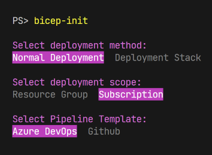

# BICEP Starter Pipelines  

Welcome to my **BICEP Starter Pipelines** repository! 😺  

Quickly set up a **Bicep project with pipelines**.  
> ⚠️ Note: Looks may differ depending on your terminal.



---
## ⚠️ Prototype Notice  

> This repository is currently a **prototype** and is not fully tested.  
>
> It contains two main components:  
> 1. **Deployment Templates** – A repo for deploying Bicep infrastructure locally or via pipeline.  
> 2. **Registry Template** – A setup for a custom Bicep registry, including a module publishing pipeline.  
>
> I also included [Bicep tests](https://github.com/Azure/bicep/issues/11967), which are still in development.  
>
> Please be gentle 😅🦖 — I may improve it in the future. Meanwhile, I hope it’s helpful. 😊  
---

## ☑️ Supported Platforms  

Tested mostly on **Windows**, but it should also work on **Linux** and **macOS**:

- ✅ Windows  
- ⚠️ Linux (tested on Ubuntu desktop)  
- ⚠️ macOS  

---

## 🚀 Usage  

### Method 1: Install from [PowerShell Gallery](https://www.powershellgallery.com/packages/BicepStarterPipelines)

1. Install the module:
```powershell
PS> Install-Module -Name BicepStarterPipelines -Scope CurrentUser
````

2. Run the initialization command:

```powershell
PS> bicep-init
```

---

### Method 2: Try Without Installation

#### 🔹 VS Code Launch Task

1. Open the repository in VS Code.
2. Press `F5` to start the Launch Task:

```powershell
PS> bicep-init ./destinationFolder
```

---

#### 🔹 PowerShell Script

1. Open terminal in the repository folder.
2. Run the script:

```powershell
PS> ./bicep-init ./destinationFolder
```

---

## 📖 Notes & Tips

* You can adjust the **destination folder** in both methods.
* This repo is meant as a **starter template**, so feel free to fork and adapt it.
* Contributions or feedback are welcome — just keep it friendly 😸.

---

## 💡 Future Ideas

* Add more **platform testing** for Linux/macOS.
* Include **optional CI/CD pipeline examples**.
* Expand the **Bicep tests** section when official support is ready.